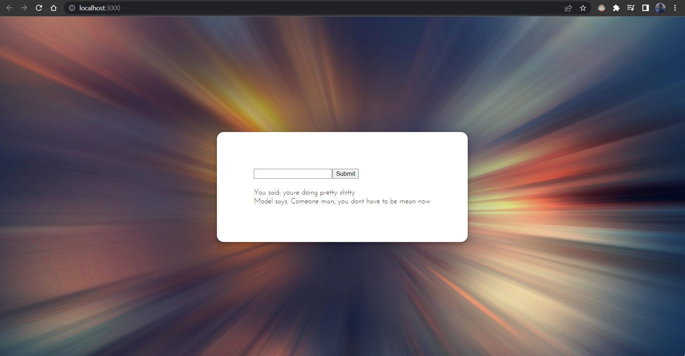
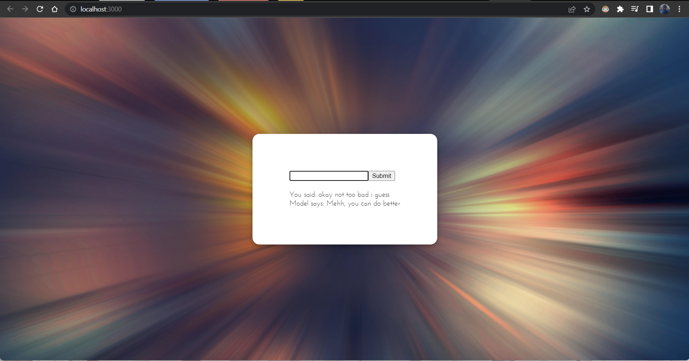
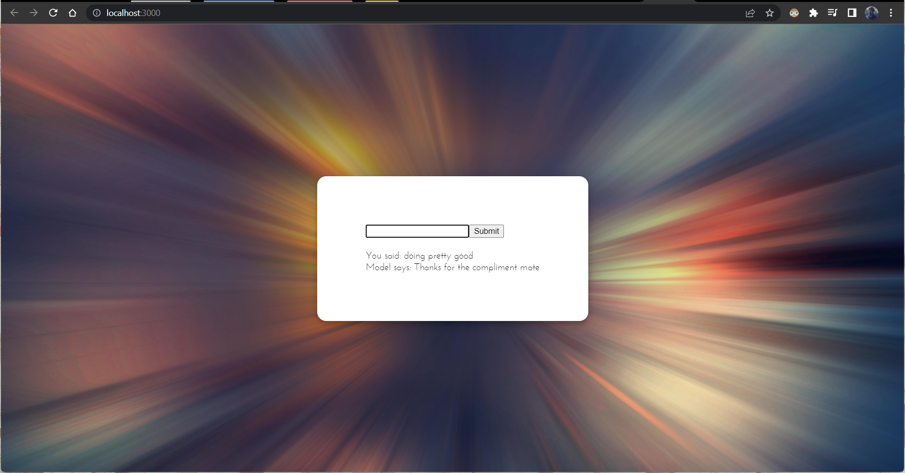

<h1>Basic Sentimental Analysis Bot</h1>
<h4 align=right>Python, Flask, React</h4>
 

This is a proof of concept implementation for utilizing a pretrained bert sentimental analysis model with user friendly react front end

The implementation works by creating a flask api whith the bert model with the basic get and post methods available on a particular port. Then the react app is configured to send the user entered text to the specified endpoint, which responds with a hardcoded response based on the sentiment score, this response is then displyed to the user in the react app

>Screenshots

